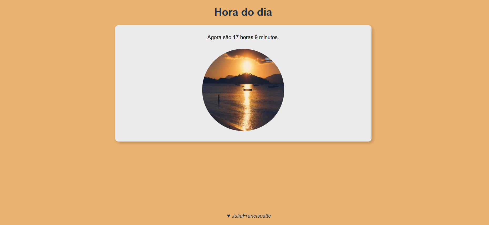

# 🕒 Relógio Dinâmico com Tema por Período do Dia

Este projeto exibe o **horário atual em tempo real**, muda automaticamente a **imagem principal** e o **background da página** com base no período do dia: manhã, tarde ou noite. Desenvolvido com base em exercício do Curso em Vídeo para treino de tecnologias WEB

  

## 🚀 Tecnologias

Esse projeto foi desenvolvido com as seguintes tecnologias:

- **HTML** – Estrutura do site
- **CSS** – Estilização
- **JavaScript** – Lógica do relógio e mudanças dinâmicas

## ⚙️ Funcionalidades

- ⏰ **Relógio em tempo real**.
- 🌅 **Períodos do dia detectados automaticamente**:
  - **Manhã**: 06:00 às 11:59
  - **Tarde**: 12:00 às 17:59
  - **Noite**: 18:00 às 05:59
- 🖼️ **Imagem principal e fundo** mudam conforme o horário:
  - Imagem representativa do período
  - Background com cores harmônicas

## 💻 Projeto

O verificador de hora foi criado para explorar e desenvolver habilidades, criatividade.

Feito com ♥ by JúliaFranciscatte
